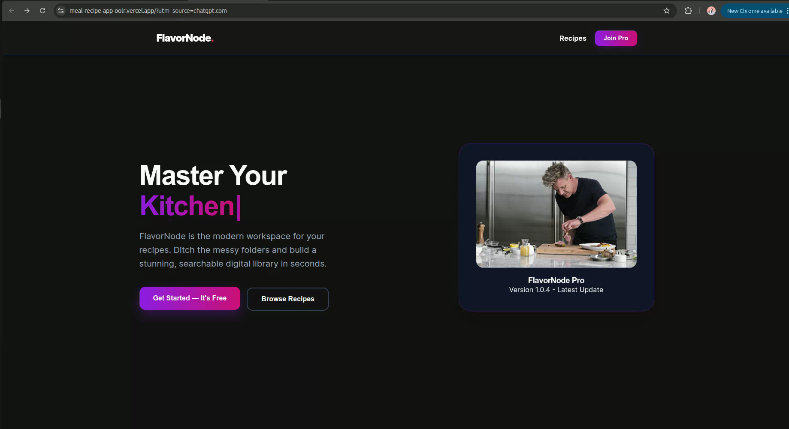
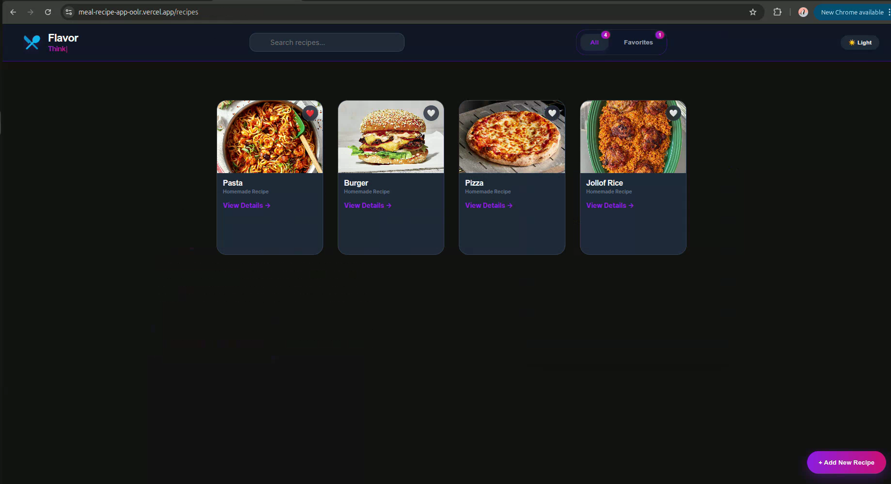
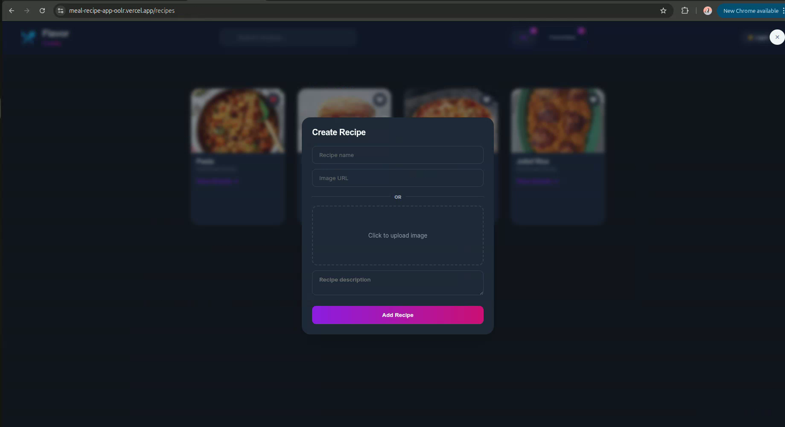
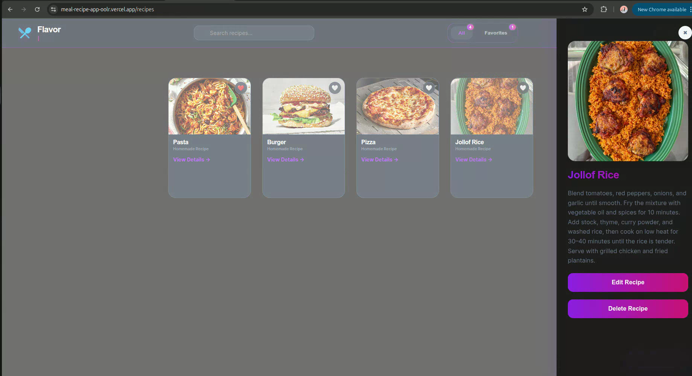

<div align="center">

# Nyap Bless Ringnyu

### Fullstack Web Developer

📍 Cameroon &nbsp;|&nbsp; 📧 nyapblesso@gmail.com &nbsp;|&nbsp; 💼 [LinkedIn](https://www.linkedin.com/in/nyapblessringnyu) &nbsp;|&nbsp; 🐙 [GitHub](https://github.com/nyapblesso-a11y)

**Open to Work** — Remote roles, freelance projects & open-source collaboration

</div>

---

## 👋 About Me

I am a **Fullstack Web Developer** based in Cameroon who builds fast, accessible, and user-centered web applications. I am comfortable working across the full stack from designing React UIs to building REST APIs with Node.js and managing relational and document databases.

- **Role:** Fullstack Web Developer (Frontend-leaning)
- **Stack:** React · Next.js · Node.js · PostgreSQL · MongoDB
- **Looking for:** Remote fullstack or frontend developer roles
- **Contact:** nyapblesso@gmail.com

---


## 🛠 Tech Stack

**Frontend**


**Backend**


**Databases**


**Tools**


---

## 📁 Project: FlavorNode — Personal Recipe Manager

**Role:** Fullstack Developer &nbsp;|&nbsp; **Live Demo:** [meal-recipe-app-oolr.vercel.app](https://meal-recipe-app-oolr.vercel.app) &nbsp;|&nbsp; **Repo:** [MealRecipe-app](https://github.com/nyapblesso-a11y/MealRecipe-app)

---

---

### 📌 Problem Statement

**Who has the problem?**
Home cooks and food enthusiasts who create their own recipes but have no structured, searchable place to store and revisit them. They rely on scattered notes, WhatsApp messages, or Google Docs formats that are disorganized and visually unpleasant.

**Why it matters?**
Without a personal recipe library, people repeat the effort of recreating dishes from memory, lose favourite recipes, and have no way to present their cooking knowledge in a visual and organized format.

**Why this solution exists?**
FlavorNode gives users a fast, clean digital workspace to build a personal recipe library, where they can add recipes with images and descriptions, mark favourites, search by name, and view full recipe details in a slide-in panel. All from a single, deployed web app.

---

### 🏗 Technical Architecture

```
meal-recipe-app/
├── public/
├── src/
│   ├── components/
│   │   ├── Navbar.jsx          # Navigation, search bar, favourites badge, theme toggle
│   │   ├── RecipeCard.jsx      # Individual recipe card with image, title, favourite button
│   │   ├── RecipeDetail.jsx    # Slide-in detail panel with full info, edit and delete actions
│   │   ├── CreateRecipeModal.jsx # Modal form for adding new recipes
│   │   └── EmptyState.jsx      # Displayed when no recipes exist or search returns nothing
│   ├── App.jsx                 # Root component — state management, routing logic
│   ├── main.jsx                # Entry point
│   └── index.css               # Global styles and Tailwind directives
├── index.html
├── vite.config.js
├── tailwind.config.js
└── package.json
```

**Frontend:** React (Vite) with Tailwind CSS. Component-based architecture — each UI section is an isolated, reusable component. State is managed at the `App.jsx` level and passed down via props.

**Backend:** No backend currently. All data is managed in React component state. A Node.js + Express + PostgreSQL backend is planned as the next iteration to enable persistent storage and user accounts.

**Database:** Currently client-side state only. Planned: PostgreSQL for structured recipe and user data.

**API Communication:** No external API. The app is fully user-driven — users create all content themselves. Image support via URL input or local file upload.

---

### ✨ Features

- **Create Recipes** — Add a recipe name, image (URL or file upload), and description via a clean modal form
- **Browse Library** — All recipes displayed in a responsive card grid with food photos and quick-view links
- **Search** — Real-time search filters the recipe list by name as the user types
- **Favourites** — Mark or unmark recipes as favourites; live counter displayed in the navbar
- **Recipe Detail Panel** — Slide-in side panel showing the full recipe image, title, and cooking instructions
- **Edit and Delete** — Update or remove any recipe directly from the detail panel
- **Dark / Light Mode** — Full theme toggle applied across all components; default is dark mode
- **Responsive Design** — Layout adapts cleanly across mobile, tablet, and desktop screen sizes
- **Input Validation** — Form blocks submission without a recipe name; empty states handled with friendly UI messages

---

### 📸 Screenshots

**Landing Page**



**Recipe Library — All Recipes View**



**Create Recipe Modal**



**Recipe Detail Panel (Light Mode)**



---